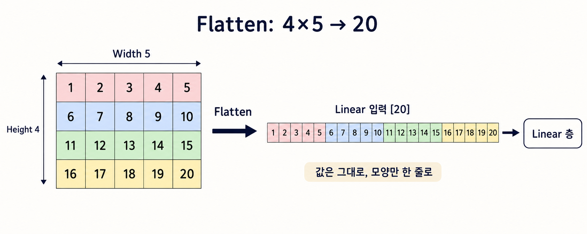

# PyTorch 이미지 데이터 처리와 학습 핵심 정리

## 1. 전체 흐름

```text
원본 Dataset 준비
-> 인덱스를 Train/Valid/Test로 분할
-> Split별 Wrapper와 Transform 적용
-> Train 데이터의 채널별 평균·표준편차 계산
-> 같은 값으로 Train/Valid/Test 정규화
-> DataLoader로 Batch 생성
-> CNN 특징 추출
-> Flatten
-> Linear 층
-> Gradient 계산 및 가중치 업데이트
```

## 2. 원본 Dataset과 인덱스 분할

### 원본 데이터를 복사하지 않는 이유

`random_split`은 원본 데이터를 Train/Valid/Test용으로 세 번 복사하지 않음. 하나의 원본 Dataset을 두고 각 Split이 사용할 데이터 번호인 인덱스만 나눠 가짐.

```text
raw_dataset
[0][1][2][3] ... [99]

Train 인덱스 -> [42, 17, 8, ...] 70개
Valid 인덱스 -> [11, 63, ...]     15개
Test 인덱스  -> [5, 91, ...]      15개
                       ↓
               같은 raw_dataset 조회
```

이미지 데이터는 크기 때문에 데이터를 세 벌로 복사하는 것보다 원본 한 벌과 인덱스만 관리하는 것이 효율적임.

### 재현 가능한 인덱스 분할

```python
import torch
from torchvision import datasets
from torch.utils.data import random_split

raw_dataset = datasets.ImageFolder(
    root="data/images",
    transform=None
)

total_size = len(raw_dataset)
train_size = int(total_size * 0.7)
valid_size = int(total_size * 0.15)
test_size = total_size - train_size - valid_size

split_generator = torch.Generator().manual_seed(42)

train_part, valid_part, test_part = random_split(
    raw_dataset,
    [train_size, valid_size, test_size],
    generator=split_generator
)
```

`manual_seed(42)`를 사용하면 코드를 다시 실행해도 같은 데이터가 같은 Split에 배정됨.

```text
random_split
-> 원본 인덱스를 무작위로 섞음
-> Train 개수만큼 배정
-> Valid 개수만큼 배정
-> 나머지를 Test에 배정
```

Seed는 Split 인덱스를 고정하는 것이며 Train의 무작위 데이터 증강 결과까지 자동으로 고정하는 것은 아님.

## 3. Wrapper Dataset

### Wrapper를 사용하는 이유

`random_split`으로 만든 `train_part`, `valid_part`, `test_part`는 모두 같은 `raw_dataset`을 바라봄.

```text
Train ─┐
Valid ─┼-> 같은 raw_dataset
Test  ─┘
```

따라서 원본 Dataset의 `transform`을 Train 증강으로 변경하면 Valid와 Test에도 같은 Transform이 적용됨. Split마다 다른 Transform을 적용하기 위해 Wrapper를 사용함.

```python
from torch.utils.data import Dataset

class SubsetWithTransform(Dataset):
    def __init__(self, base_dataset, indices, transform=None):
        self.base_dataset = base_dataset
        self.indices = list(indices)
        self.transform = transform

    def __len__(self):
        return len(self.indices)

    def __getitem__(self, idx):
        x, y = self.base_dataset[self.indices[idx]]

        if self.transform is not None:
            x = self.transform(x)

        return x, y
```

Wrapper가 저장하는 것은 다음 세 가지임.

| 구분 | 항목 | 역할 |
|---|---|---|
| 원본 | `base_dataset` | 원본 Dataset 객체를 참조 |
| 범위 | `indices` | 해당 Split이 사용할 원본 번호 저장 |
| 처리 | `transform` | 데이터를 가져온 후 적용할 변환 규칙 |

동작 예시:

```text
train_dataset[0] 요청
-> train indices의 0번째 값 확인
-> indices[0]이 42라면 raw_dataset[42] 조회
-> train_transform 적용
-> x, y 반환
```

`self.base_dataset = base_dataset`은 원본 데이터를 복사하는 것이 아니라 원본 Dataset 객체를 가리키는 참조를 저장하는 것임.

### 원본을 `transform=None`으로 두는 이유

원본 Dataset이 데이터를 가공하지 않은 상태로 반환해야 각 Wrapper가 서로 다른 Transform을 적용할 수 있음.

```text
raw_dataset: transform 없음
├-> Train Wrapper -> 증강과 정규화 적용
├-> Valid Wrapper -> 필수 전처리와 정규화 적용
└-> Test Wrapper  -> 필수 전처리와 정규화 적용
```

원본에 Train 증강을 넣으면 Valid와 Test도 증강된 데이터를 받거나 Transform이 이중으로 적용될 수 있음.


## 4. 채널별 평균과 표준편차

### 채널별로 계산하는 이유

RGB 이미지는 세 개의 채널별 숫자판으로 구성됨.

```text
R 채널 -> 각 위치의 빨간색 강도
G 채널 -> 각 위치의 초록색 강도
B 채널 -> 각 위치의 파란색 강도
```

R, G, B는 픽셀값의 분포가 서로 다를 수 있으므로 각 채널의 평균과 표준편차를 따로 계산하여 정규화함.

$$x'_c=\frac{x_c-\mu_c}{\sigma_c}$$

- `c`: R, G, B 중 하나의 채널
- `μ`: 해당 채널의 평균
- `σ`: 해당 채널의 표준편차

이미지 10장이 모두 `64×64`라면 채널별로 다음 개수의 값을 사용함.

```text
R 평균·표준편차 -> 10 × 64 × 64개의 R 값
G 평균·표준편차 -> 10 × 64 × 64개의 G 값
B 평균·표준편차 -> 10 × 64 × 64개의 B 값
```

### `Normalize`의 역할

`Normalize`는 평균과 표준편차를 계산하지 않음. 미리 계산하여 전달한 값을 각 채널에 적용함.

```python
transforms.Normalize(
    mean=(R평균, G평균, B평균),
    std=(R표준편차, G표준편차, B표준편차)
)
```

다음 코드는 실제 데이터 통계가 아니라 `0~1` 범위의 중간값인 `0.5`를 편의상 사용한 것임.

```python
transforms.Normalize(
    mean=(0.5, 0.5, 0.5),
    std=(0.5, 0.5, 0.5)
)
```

`ToTensor()`가 픽셀값을 `0~1`로 변환하므로 이 설정을 적용하면 대체로 `-1~1` 범위로 변환됨.

### Train 데이터만 사용하는 이유

평균과 표준편차는 Train 데이터에서만 계산함.

```text
Train 데이터 -> 평균·표준편차 계산
                        ↓
Train ──────────────────┤
Valid ──────────────────┼-> 같은 평균·표준편차 적용
Test ───────────────────┘
```

Valid와 Test 데이터의 통계를 계산에 포함하면 평가 데이터를 미리 사용한 데이터 누수가 발생할 수 있음.

## 5. 채널별 평균과 표준편차 계산 코드

평균과 표준편차를 계산할 때는 데이터 증강과 `Normalize`를 제외하고 `Resize`와 `ToTensor`만 적용함.

```python
from torchvision import transforms
from torch.utils.data import DataLoader

stats_transform = transforms.Compose([
    transforms.Resize((64, 64)),
    transforms.ToTensor()
])

stats_dataset = SubsetWithTransform(
    base_dataset=raw_dataset,
    indices=train_part.indices,
    transform=stats_transform
)

stats_loader = DataLoader(
    stats_dataset,
    batch_size=32,
    shuffle=False
)

channel_sum = torch.zeros(3)
channel_squared_sum = torch.zeros(3)
pixel_count = 0

for images, _ in stats_loader:
    channel_sum += images.sum(dim=(0, 2, 3))
    channel_squared_sum += (images ** 2).sum(dim=(0, 2, 3))
    pixel_count += images.shape[0] * images.shape[2] * images.shape[3]

mean = channel_sum / pixel_count
std = torch.sqrt(
    channel_squared_sum / pixel_count - mean ** 2
)

print("mean:", mean)
print("std:", std)
```

이미지 Batch의 Shape은 다음과 같음.

```text
[Batch, Channel, Height, Width]
```

`dim=(0, 2, 3)`으로 합계를 구하면 다음 차원을 계산하고 채널 차원만 남김.

```text
0 -> Batch
2 -> Height
3 -> Width

남는 차원
1 -> Channel
```

출력이 다음과 같다고 가정함.

```text
mean: tensor([0.48, 0.45, 0.40])
std:  tensor([0.23, 0.22, 0.24])
```


## 6. Split별 Transform 적용

Train에는 데이터 증강을 적용하고 Valid와 Test에는 적용하지 않음. 정규화에는 모두 Train 데이터에서 계산한 같은 평균과 표준편차를 사용함.

```python
train_transform = transforms.Compose([
    transforms.Resize((64, 64)),
    transforms.RandomHorizontalFlip(p=0.5),
    transforms.ToTensor(),
    transforms.Normalize(
        mean=mean.tolist(),
        std=std.tolist()
    )
])

valid_transform = transforms.Compose([
    transforms.Resize((64, 64)),
    transforms.ToTensor(),
    transforms.Normalize(
        mean=mean.tolist(),
        std=std.tolist()
    )
])

test_transform = transforms.Compose([
    transforms.Resize((64, 64)),
    transforms.ToTensor(),
    transforms.Normalize(
        mean=mean.tolist(),
        std=std.tolist()
    )
])
```

Wrapper에 각 Transform을 연결함.

```python
train_dataset = SubsetWithTransform(
    raw_dataset,
    train_part.indices,
    train_transform
)

valid_dataset = SubsetWithTransform(
    raw_dataset,
    valid_part.indices,
    valid_transform
)

test_dataset = SubsetWithTransform(
    raw_dataset,
    test_part.indices,
    test_transform
)
```

```text
원본 데이터는 한 벌
-> Split마다 사용할 인덱스가 다름
-> Wrapper마다 적용할 Transform이 다름
```

## 7. `flatten()`과 `nn.Flatten()`

여러 차원의 데이터를 한 줄짜리 벡터로 펼치는 기능임.

| 구분 | `x.flatten()` | `nn.Flatten()` |
|---|---|---|
| 종류 | Tensor 메서드 | 신경망 Layer |
| 기본 `start_dim` | `0` | `1` |
| Batch 유지 | `start_dim=1` 직접 지정 | 기본적으로 유지 |
| 주요 사용 위치 | `forward()` 내부 | `nn.Sequential` 내부 |

다음 두 코드는 Batch 차원을 유지하면서 나머지 차원을 펼친다는 점에서 같은 역할을 함.

```python
x = x.flatten(start_dim=1)
```

```python
flatten = nn.Flatten()
x = flatten(x)
```

## 8. Flatten을 사용하는 이유

CNN 출력은 일반적으로 다음과 같은 4차원 Tensor임.

```text
[Batch, Channel, Height, Width]
```

`Linear` 층에 넣기 위해 이미지 한 장의 모든 특징값을 한 줄로 변환함.

```text
[Batch, Channel, Height, Width]
-> Flatten
[Batch, Channel × Height × Width]
-> Linear
```

예시:

```text
[32, 3, 4, 5]
-> Flatten
[32, 60]
```

- `32`: Batch이므로 유지
- `3 × 4 × 5 = 60`: 이미지 한 장의 특징값

Flatten은 값을 변경하지 않고 Tensor의 모양만 변경함.

### `4×5` 데이터의 Flatten

```text
1번째 줄:  1  2  3  4  5
2번째 줄:  6  7  8  9 10
3번째 줄: 11 12 13 14 15
4번째 줄: 16 17 18 19 20
```

```text
Flatten
-> [1, 2, 3, 4, 5, 6, 7, 8, 9, 10, ..., 20]
```

이미지를 조각으로 자르는 것이 아니라 이미지 또는 특징 맵의 **셀 값**을 순서대로 **한 줄에 나열**하는 것임.

채널이 3개라면 다음 순서로 펼쳐짐.

```text
첫 번째 채널 20개
-> 두 번째 채널 20개
-> 세 번째 채널 20개
-> 총 60개
```



## 9. Gradient 누적과 초기화

가중치와 Gradient는 별도로 저장됨.

```text
parameter      -> 학습으로 변경되는 가중치
parameter.grad -> 계산된 Gradient 저장 공간
```

`backward()`는 새로운 Gradient를 기존 `.grad`에 덮어쓰지 않고 누적함.

```text
첫 번째 backward()
parameter.grad = 3

두 번째 backward()
새 Gradient = 4
parameter.grad = 3 + 4 = 7
```

`optimizer.step()`은 가중치를 업데이트하지만 `.grad`를 초기화하지 않음.

```text
optimizer.step()
-> parameter 업데이트
-> parameter.grad는 그대로 유지
```

따라서 새로운 Batch를 학습하기 전에 이전 Gradient를 초기화해야 함.

## 10. `optimizer.zero_grad(set_to_none=True)`

```python
optimizer.zero_grad(set_to_none=True)
loss.backward()
optimizer.step()
```

| 코드 | 역할 |
|---|---|
| `zero_grad()` | 이전 Gradient 초기화 |
| `backward()` | 새로운 Gradient 계산·저장 |
| `step()` | Gradient를 이용하여 가중치 업데이트 |

`zero_grad()`는 이전 Gradient를 초기화하는 함수이고 `set_to_none`은 초기화 방식을 선택하는 옵션임.

| 설정 | 초기화 결과 | 다음 `backward()` |
|---|---|---|
| `set_to_none=False` | 값이 0인 Gradient Tensor | 0에 새 Gradient를 더함 |
| `set_to_none=True` | `.grad = None` | 새 Gradient Tensor를 생성함 |

## 11. `0`과 `None`의 차이

```text
grad = 0 Tensor
-> Gradient Tensor가 존재함
-> 저장된 값이 모두 0

grad = None
-> .grad 속성은 존재함
-> Gradient Tensor 자체는 저장되어 있지 않음
```

```python
parameter.grad = torch.tensor([0.0, 0.0])
parameter.grad = None
```

Optimizer는 일반적으로 다음처럼 처리함.

```text
grad = None -> 해당 가중치 업데이트를 건너뜀
grad = 0    -> Gradient가 존재하는 것으로 처리
```

`set_to_none=True`는 0 Tensor를 채우는 작업을 생략하므로 메모리 사용과 연산을 줄일 수 있음.