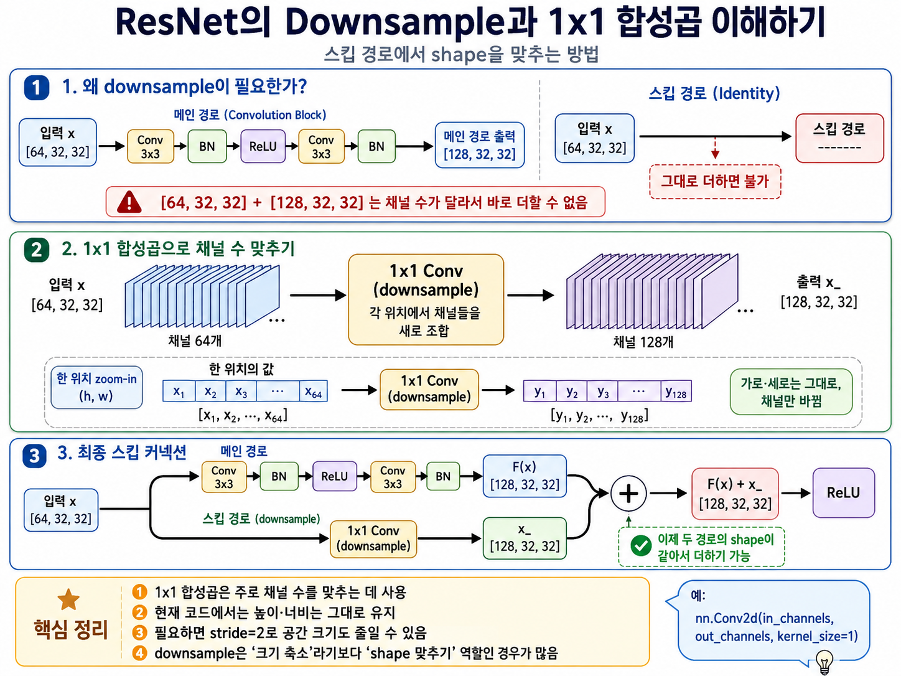

# 용어 정의
`퍼셉트론(인공뉴런)` : 입력값과 가중치, 편향을 이용해 출력값을 내는 수학적 모델
`단층 인공 신경망` : 퍼셉트론을 하나만 사용하는 인공 신경망
`다층 인공 신경망` : 퍼셉트론을 여러 개 사용하는 인공 신경망
`입력층` : 입력값을 표현
`출력층` : 신경망의 출력값을 계산
`은닉층` : 입력층 이후부터 출력층 전까지
`가중치` : 입력의 중요도
==`편향` : 활성화의 경계가 원점으로부터 얼마나 이동할지를 결정==
`손실 함수`: 정답과 신경망의 예측의 차이를 나타내는 함수
`경사 하강법` : 손실을 가중치에 대해 미분한 다음, 기울기의 반대 방향으로 학습률만큼 이동시키는 알고리즘
`오차 역전파`: 올바른 가중치를 찾기 위해 오차를 출력층으로부터 입력층까지 전파하는 방식
`오버피팅(과적합)` : 학습에 사용한 데이터에 최적화되게 학습되어서 다른 데이터에 대한 예측 성능이 떨어지는 경우
`기울기 소실`: 출력층으로부터 멀어질수록 역전파되는 오차가 0에 가까워지는 현상


# 문제
###### 1. 층을 하나인 신경망과 여러 개인 신경망을 지칭하는 용어를 각각 쓰시오.
```
단층 신경망, 다층 신경망
```
###### 2. 경사 하강법이 미분한 결과를 빼주는 이유는 무엇인가?
```
경사 하강법은 기울기의 반대 방향으로 이동하는 알고리즘이므로, 기울기값을 빼줘야 한다.
```
###### 3. 학습용 데이터를 완벽하게 분류하는 모델은 좋은 모델인가?
```
오버피팅된 모델이므로 반드시 좋다고 할 수 없다.
```
###### 4. 이진 분류에서 활성화 함수로 시그모이드 함수를 사용하는 이유는 무엇인가?
```
출력값을 0과 1 사이로 범위를 제한하기 때문에
```
###### 5. 데이터를 올바르게 분류하는 가중치를 찾으려면 어떻게 해야 하는가?
```
손실 함수를 이용해 손실을 계산한 후, 오차 역전파를 통해 출력층으로부터 입력층까지 오차를 역전파한다.
```

# Chapter 3 간단한 신경망 만들기
## 개요
#### 학습 목표
- 가중치를 이용해 학습하는 신경망 만들기
  ㄴ 실습: 사인 함수 예측, 보스턴 집값 예측(회귀 분석), 손글씨 분류(다중분류) 신경망
- 실제 오차 계산 후 역잔파 수행하여 가중치 수정
- 손실함수 설명
  ㄴ 손실함수 : 평균 제곱 오차, 크로스 엔트로피 오차

#### 핵심 용어
`모듈` : 파이토치에서 신경망을 구성하는 기본 객체
	- `__init()__`: 구성요소 정의
	- `__forward()` : 순전파의 동작 정의
`nn.Sequential` : 간단한 신경망
	- 층을 샇기만 하는 간단한 구조에서 사용하기에 편리함.
	- 하지만, 은닉층에서 순전파 도중의 결과를 저장한다거나 데이터 흘므을 제어하는 등의 커스터마이징 불가
`nn.Module` : 복잡한 신경망
	- 자신이 원하는 대로 신경망 동작 정의 가능
`MSE(평균 제곱 오차)`: 값의 차이의 제곱의 평균 -> 회귀
`CE(크로스 엔트로피)`: 두 확률 분포의 차이 -> 분류
`피처(feature)`: '특징', 신경망의 입력으로 들어오는 값으로 데이터가 갖고 있는 특징

`배치` : 데이터셋의 일부, 신경망의 입력으로 들어가는 단위
`에포크`: 전체 데이터를 모두 한 번씩 사용했을 때의 단위
`이터레이션`: 하나의 에포크에 들어있는 배치 수


`최적화 알고리즘`: 역전파된 기울기를 이용해 가중치를 수정하는 알고리즘
`Adam`: 모멘텀과 RMSprop을 섞어놓은 가장 흔하게 사용되는 최적화 알고리즘
`모멘텀`: 기울기를 계산할 때 관성을 고려하는 것
`RMSprop`: 이동평균을 이용해 이전 기울기보다 현재의 기울기에 더 가중치를 두는 알고리즘

#### 파이토치의 인공 신경망
- 파이토치는 딥러닝에 사용되는 대부분의 신경망을 torch.nn 모듈에 모아놨음.
- 딥러닝은 신경망 층을 깊게 쌓아올려서 만드는데, 파이토치도 여러 층을 쌓아서 딥러닝 모델 생성
- 층(Layer)은 nn.Module 객체를 상속받아 정의되고, 층이 쌓이면 딥러닝 모델이 완성됨


### 연습문제
###### 1. 풍향과 풍량, 습도, 지역을 입력받아 그 날의 기온을 예측하는 문제는 회귀 문제일까? 분류 문제일까?
```
회귀 문제 - 기온은 연속적인 값을 갖고 있기 때문에
```
###### 2. 감시 카메라 영상을 입력받아 수상한 사람인지 아닌지 예측하는 문제는 회귀 문제일까? 분류 문제일까?
```
분류 문제 - 수상한가/아닌가 둘 중 어느 범주에 들어가는지 분류
```
###### 3. 총 5,000장의 이미지를 데이터로 갖고 있고, 한 번 학습할 때 50장씩 불러오고, 갖고 있는 데이터를 총 50번 반복하고 싶다면 배치 크기와 에포크, 이터레이션은 각각 얼마인가?
```
배치 크기 = 50 (이미지 5,000장을 50장씩 불러옴)
이터레이션 = 100 (5,000장을 모두 한 번씩 불러오려면 총 100번 반복 / 5,000/50=100)
에포크 = 50 (갖고 있는 데이터를 총 50번 반복)
```
###### 4. reshape(data, (-1, 1024))를 이용해 이미지를 일렬로 폈다면 원래 이미지의 가로 세로 픽셀의 개수는 얼마였을까?
```
32개 (32**2 = 1024)
```
###### 5. 특징 100개를 입력받아 출력 10개를 내보내는 층을 만들고 싶다면 어떻게 해야 하는가?
```
nn.Linear(100, 10)
```

# Chapter 4 사진 분류하기 (CNN과 VGG)
## 개요
#### □ 학습 목표
- CNN 모델 생성 (이미지 처리 딥러닝 모델)
- VGG 모델 공부 (기초적인 CNN 모델)
	- CIFAR-10(10가지 사물&동물 사진) 사용해서 이미지 분류
#### □ 학습 순서
4.1 이해하기 : CNN
4.2 데이터 전처리
	- 데이터 증강
	- 이미지 정규화
4.3 CNN으로 이미지 분류하기
	- 모델 정의하기
	- 모델 학습하기
	- 모델 성능 평가하기
4.4 전이 학습 모델 VGG로 분류하기
	- 사전 학습된 모델 불러오기
	- 학습 루프 정의하기
	- 학습 및 성능 평가하기

#### □ 핵심 용어 미리보기
`합성곱` : 작은 필터를 이용해 이미지로부터 특징을 뽑아내는 알고리즘
`CNN`: 합성곱층을 반복적으로 쌓아서 만든 인공 신경망
`특징 맵`: 합성곱층의 결과, 합성곱층이 특징을 추출한 뒤의 이미지
`데이터 증강`: 이미지를 회전시키거나 잘라내는 등, 데이터 하나로 여러 가지 형태의 다른 데이터를 만들어 개수를 늘리는 방법
`데이터 전처리`: 학습에 이용되기 이전에 처리하는 모든 기법
`이미지 정규화`: 이미지의 픽셀 간 편향을 제거하는데 사용(각 채널의 분포가 동일해지므로 학습이 원활하게 이루어짐)
`패딩`: 이미지 외곽을 0으로 채우는 기법, 합성곱 전후 이미지 크기를 같게 만듦
`크롭핑`: 이미지의 일부분을 잘라내는 것
`최대 풀링(max pooling)`: 이미지 크기를 줄이는 데 사용하는 기법으로 커널에서 가장 큰 값을 이용함
`전이 학습`: 사전 학습된 모델의 파라미터를 수정해 자신의 데이터셋에 최적화시키는 방법(학습에 걸리는 시간을 단축할 수 있음)
`커널`: 이미지로부터 특징을 추출하기 위한 가중치를 행렬로 나타낸 것
	이미지 크기와 무관하게 학습해야 하는 가중치 개수가 같다.
`필터`: 커널의 집합

## 4.1 이해하기: CNN

`CNN`: Convolutional Neural Network (=) 합성곱 신경망, 콘볼루션 신경망)
- 합성곱을 사용하는 신경망
- 이미지에 특징이 하나만 있는 게 아니기 때문에 CNN의 한 층에 필터를 여러 개 준비함.
- `특징 맵(feature map)`: 합성곱의 결과로부터 얻어지는 이미지. 합성곱으로부터 얻어진 특징이 그려진 이미지라서 특징 맵이라고 불림
- `스트라이드(stride)`: 커널의 이동 거리
- 특징 맵은 다음 합성곱층의 입력으로 들어감
- 여러 합성곱층을 쌓아 만든 모델을 CNN이라고 부름

#### 자주 사용되는 CNN 모델
##### 자주 사용되는 CNN  모델

| CNN 모델    | 특징                                                                                          |                                   |
| --------- | ------------------------------------------------------------------------------------------- | --------------------------------- |
| VGG       | - 가장 기본이 되는 CNN<br>- VGG는 3x3 크기의 커널을 이용해서 가중치 개수를 줄임                                       | torchvision.models.vgg16()        |
| ResNet    | - 입력 이미지와 특징 맵을 더하는 CNN<br>- 층이 깊어질수록 역전파되는 오차가 작아지는 문제를 어느 정도 해결함<br>- 가장 많이 사용함           | torchvision.models.resnet18()     |
| Inception | - 3x3 커널을 여러 번 중첩해 크기가 큰 커널을 근사함<br>- VGG보다 넓은 시야를 갖게 됐으며, 큰 크기의 커널보다 적은 수의 가중치로 비슷한 효과를 얻음 | torchvision.models.inception_v3() |

#### 4.2.1 데이터 증강
`데이터 증강`: 이미지에 여러 변형을 주어 이미지 개수를 늘리는 기법
ㄴ 회전(Rotation), 크기 변경, 밀림(Shearing), 반사(Reflection), 이동(Transition) 등 사용
`패딩(padding)`: 이미지의 특정 영역을 0으로 채우는 기법. 
`크롭핑(cropping)`: 이미지의 일정 부분을 도려내는 기법. 불필요한 부분을 도려낼 때 사용

#### 4.2.2 이미지 정규화
`정규화(normalization)`: 데이터의 분포를 정규분포의 형태로 바꿔주는 것
- 정규분포(normal distribution)는 평균과 표준편차로 설명하는 분포로, 평균이 0, 표준편차가 1인 정규분포를 표준 정규븐포라고 함.
- 가우스 분포(Gaussian distribution)라고도 함
- 예를 들어, 빨간색 자동차 이미지가 있을 때 적색 값들의 분포가 높은 반면에 녹색과 청색은 낮다. 정규화 과정을 거치고 나면 모든 색의 분포가 정규분포를 따르게 된다.


## 4.4 전이 학습 모델 VGG로 분류하기
- CIFAR-10 데이터셋은 학습에 오랜 시간이 걸림(약 10분)
- 학습에 드는 시간이 적지 않은데 데이터가 달라질 때마다 매번 새로 학습해야 하는가? 미리 학습된 모델을 살짝만 변경하는 방법은 없을까? -> `전이학습`
- `전이학습` : 대규모 데이터로 사전학습을 하고 소규모 데이터로 파라미터 조정만 하는 기법
- `ImageNet`: 1천 개의 사무렝 대한 특징을 추출하도록 학습되기 때문에 이미지 처리 문제의 사전 학습에 자주 사용됨.
- ImageNet은 1천 개 뉴런이 각자 다른 값(즉 1000가지)을 보냄. -> CIFAR-10은 10가지 출력만 가져야 하기 때문에 분류기 수정
- 
#### VGG 장단점

##### 장점
- VGG는 단순한 구조를 가진 만큼 데이터가 무난한 성능을 발휘
- 구조가 간단하기 때문에 활용하기 간편함
- 데이터가 깨끗하지 않을 때도 나쁘지 않은 성능을 보임
##### 단점
- 층이 깊어지면 기울기 소실 문제 발생
- 학습이 불안정할 때가 있음.
##### 유용한 곳
- 이미지 분류, 생성, 세그멘테이션 등 이미지의 특징을 추출하는 거의 모든 곳에 사용함.
- 이미지의 특징 추출 시 사용


`Dropout(p)`: p 확률로 드롭아웃을 결정, 기본값 0.5; 50% 확률로 가중치가 사라짐(lib: torch.nn)

.png)

.png)

.png)
#### 연습문제
###### 1. 합성곱이 이미지로부터 특징을 추출하는 용도로 사용하는 것은 무엇인가?
```
커널(필터)
```
###### 2. 합성곱 전후로 이미지 크기를 동이랗게 만드는 데 사용하는 기법은 무엇인가?
```
패딩
```
###### 3. CNN에서 평탄화를 사용하는 이유는?
```
합성곱층을 거친 이미지는 특징 맵이라는 이미지가 되는데, 이미지는 MLP의 입력으로 사용될 수 없기 때문에 2차원 이미지를 1차원 벡터로 변환해줘야 한다.
```
###### 4. 사전 학습된 모델의 파라미터를 수정해서 자신의 데이터셋에 최적화시키는 학습 방법을 무엇이라고 하는가?
```
전이 학습
```
###### 5. CNN의 이미지 전처리에 해당하는 것은?
```
랜덤 크롭핑
랜덤 y축 대칭
이미지 정규화
이미지 리사이징
```
- 오답: 평탄화(flatten) - CNN의 이미지 전처리 기법이 아니고, MLP의 입력에 적합한 형태로 변환하는 기법
###### 6. 가로 세로 (224, 224) 크기의 이미지에 Conv2d(kernel_size=3, padding=0)을 이용해 합성곱을 하면 이미지 크기가 어떻게 변하는가? 
```
(222, 222)
커널 크기가 3, 패딩이 없고, 커널의 이동 거리가 1(Conv2d의 stride 기본값은 1)
-> 양쪽으로 한 픽셀씩 잘려서 출력되므로 (222, 222)
```
###### 7. x=(224, 224, 3) 크기의 텐서 x를 flatten(x, start_dim=1)을 이용해 평탄화하면 크기가 어떻게 변하는가?
```
(224, 672)
start_dim=1이므로 첫 번째 요소 이후를 평탄화 -> (224, 224*3)
```

# Chapter 5 ResNet 만들기
## 개요
#### □ 학습 목표
- ResNet 모델(스킵 커넥션을 사용하는 CNN 모델)
- 스킵 커넥션을 사용해서 VGG에 비해 훨씬 더 많은 층을 쌓을 수 있음
- nn.Module을 이용하여 신경망 내부의 데이터 흐름 제어 가능
#### □ 학습 순서
1. 이해하기
	- ResMet
	- 배치 정규화
2. 모델 정의하기
	- 기본 블록
	- ResNet 모델
3. 모델 학습하기
4. 모델 성능평가

#### □ 핵심 용어
`ResNet`: 스킵 구조를 이용한 CNN 신경망
==`기울기 소실`==: 은닉층이 깊어짐에 따라 입력층에 가까운 가중치들의 기울기가 0에 가까워지는 현상. 기울기가 0이 되면 가중치가 더 이상 업데이트되지 않기 때문에 학습이 이루어지지 않음.
`배치 정규화`: 배치 간의 차이를 정규화해주므로 더 안정되게 학습 가능함
`nn.Squential`: 커스터마이징 불가능하지만 forward() 메서드를 직접 작성할 필요가 없음. 하지만 신경망 커스터마이징이 되지 않기 때문에 복잡한 신경망에는 nn.Module을 이용함
==`스킵 커넥션`==: 은닉층을 거치지 않은 입력값과 은닉층의 결과를 더하는 구조를 의미함
`평균 풀링`: 커널의 평균값을 이용하는 풀링

## 5.1 ResNet

> [NOTE!] 스킵 커넥션
> 입력을 은닉층의 Conv·BN·ReLU 연산을 우회시켜 출력에 직접 더함으로써, 역전파 시 기울기가 전달될 수 있는 직통 경로를 제공하는 구조.
> 
> “깊은 층의 여러 연산을 거치지 않는 직접적인 경로가 하나 더 있어서 기울기가 뒤쪽에서 앞쪽으로 전달되기 쉬워진다”

#### ResNet 장단점
##### 장점
- 층을 깊게 쌓을 수 있음.
- VGG에 비해 학습이 안정적임.
- 기울기 소실 문제를 어느 정도 해결함.
##### 단점
- 가중치가 늘어나기 때문에 계산량이 많아짐.
- VGG에 비해 오버피팅이 일어나기 쉬움.
##### 유용한 곳
- 이미지 분류, 세그멘테이션, 이미지 생성 등 합성곱을 이용하는 모든 곳에서 이용 가능함.
- 이미지의 특징을 추출할 때 사용함.
- 스킵 커넥션은 이전 은닉층의 정보를 필요로 하는 텍스트 처리에서도 사용할 수 있음.


## 5.2 배치 정규화
`배치 정규화(batch normalization)`: 배치 단위를 정규화하는 기법
- 출력의 분포를 일정하게 해줌
- 모델의 입력으로 들어오는 배치의 값의 분포가 서로 다르면 배치마다 출력값의 분포 또한 달라지기 때문에 학습에 악영향을 미치는 문제를 해결하는 데 사용됨

## 5.3 ResNet 기본 블록 정의하기
- ResNet에서는 블록의 입력이 출력이 그대로 더해져야 하기 때문에 데이터 흐름이 단방향이 아님 -> nn.Module 사용
- 스킵 커넥션은 은닉층의 결과와 입력값을 더하는 구조
- 3채널 이미지와 64채널(특징 맵) 이미지는 서로 더해줄 수 없기 때문에 채널의 숫자를 맞춰줘야 함 -> 1x1 합성곱층(`다운샘플`)
- `다운샘플` : 스킵 커넥션에서 입력값과 합성곱의 결과를 더해주기 위해 입력값에 1x1 합성곱으로 채널 수를 맞춰주는 기법
- `BatchNorm2d(features)`: 배치 정규화를 실행, features개의 특징에 대하여 실행. 이미지의 채널 수에 맞추면 됨. (lib: nn)



